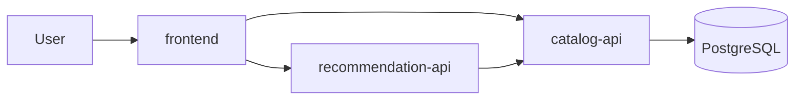

# RecipeOps Enterprise Microservice CI/CD CA

This repository contains a continuous delivery implementation for a small recipe platform:

- `frontend`: Node/Express web UI for recipe management
- `catalog-api`: Node/Express REST API backed by PostgreSQL
- `recommendation-api`: Python/FastAPI service that calls `catalog-api`
- `postgres`: local data layer for development
- `infra/terraform`: Azure Container Apps, Azure Container Registry, PostgreSQL Flexible Server, Log Analytics, and Key Vault
- `.github/workflows`: CI and CD pipeline definitions
- `docs`: release management plan and presentation material

## Local Demo

```bash
docker compose up --build
```

Then open:

- Frontend: http://localhost:8080
- Catalog API health: http://localhost:3001/health
- Recommendation API health: http://localhost:3002/health

## Run Tests Locally

```bash
npm --prefix services/catalog-api test
python3 -m pytest services/recommendation-api/tests
```

## Terraform

```bash
terraform -chdir=infra/terraform init -backend=false
terraform -chdir=infra/terraform fmt -check -recursive
terraform -chdir=infra/terraform validate
```

For CI/CD remote state, bootstrap Azure Blob state storage once:

```bash
./scripts/register-azure-providers.sh
export TF_STATE_STORAGE_ACCOUNT="strecipeopstfstate123"
./scripts/bootstrap-terraform-state.sh
```

## Architecture


