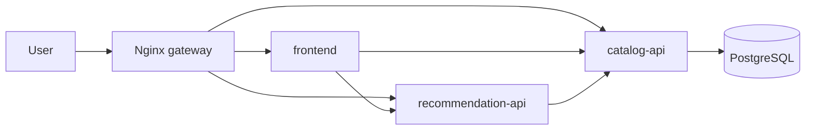

# RecipeOps Enterprise Microservice CI/CD CA

RecipeOps is a microservice recipe platform built for an enterprise-style CI/CD coursework assignment.

It contains:

- `frontend`: Node/Express web UI
- `catalog-api`: Node/Express REST API backed by PostgreSQL
- `recommendation-api`: Python/FastAPI service that calls `catalog-api`
- `postgres`: local and Hetzner data layer
- `deploy/hetzner`: working GitHub Actions to Hetzner blue/green deployment
- `infra/terraform`: Azure Container Apps infrastructure-as-code alternative
- `.github/workflows`: CI, Azure CD, and Hetzner CD workflows
- `docs`: release management plan, demo script, and presentation outline

## Architecture



## Local Demo

```bash
docker compose up --build
```

Then open:

- Frontend: `http://localhost:8080`
- Catalog API health: `http://localhost:3001/health`
- Recommendation API health: `http://localhost:3002/health`

## Run Tests Locally

```bash
npm --prefix services/catalog-api test
python3 -m pytest services/recommendation-api/tests
```

## Working CD: Hetzner

The demonstrated CD route is:

```text
GitHub Actions -> GHCR -> SSH -> Hetzner Docker Compose -> Nginx blue/green switch
```

`deploy-hetzner.yml` builds `linux/amd64` images for all services, tags them with the Git commit SHA, pushes them to GHCR, then deploys to `/opt/recipeops` on the Hetzner VM.

Required GitHub Actions secrets:

| Secret | Purpose |
|---|---|
| `HETZNER_HOST` | Server IP or DNS name |
| `HETZNER_USER` | SSH user, preferably `deploy` |
| `HETZNER_SSH_KEY` | Private SSH key for deployment |
| `POSTGRES_PASSWORD` | Runtime PostgreSQL password |
| `HETZNER_PORT` | Optional, defaults to `22` |
| `APP_HTTP_PORT` | Optional, defaults to `80` |
| `GHCR_USERNAME` | Optional GHCR username |
| `GHCR_TOKEN` | Optional GHCR read token if packages are private |

Useful server checks:

```bash
cd /opt/recipeops
cat .env
docker ps --format 'table {{.Names}}\t{{.Ports}}'
```

Public checks:

```bash
curl http://SERVER_IP
curl http://SERVER_IP/api/catalog/health
curl http://SERVER_IP/api/catalog/recipes
curl http://SERVER_IP/api/recommendations/health
```

Rollback:

```bash
cd /opt/recipeops
./rollback.sh
```

By default this switches to the opposite color from the current `ACTIVE_COLOR`. To force a specific target, use `./rollback.sh blue` or `./rollback.sh green`.

## Terraform Azure Alternative

The Azure Terraform module is retained as the managed cloud/IaC option:

```bash
terraform -chdir=infra/terraform init -backend=false
terraform -chdir=infra/terraform fmt -check -recursive
terraform -chdir=infra/terraform validate
```

For CI/CD remote state, bootstrap Azure Blob state storage once:

```bash
./scripts/register-azure-providers.sh
export TF_STATE_STORAGE_ACCOUNT="strecipeopstfstate123"
./scripts/bootstrap-terraform-state.sh
```

The Azure CD workflow is manual because the project tenant blocked the app registration, service principal, and federated credential setup required for fully automated GitHub OIDC deployment. See `infra/terraform/README.md`.

## Documentation

- `docs/release-management-plan.pdf`: final RMP report
- `docs/release-management-plan.tex`: LaTeX source for the RMP report
- `docs/RecipeOps-CICD-Presentation.pptx`: presentation deck
- `deploy/hetzner/README.md`: Hetzner runbook
