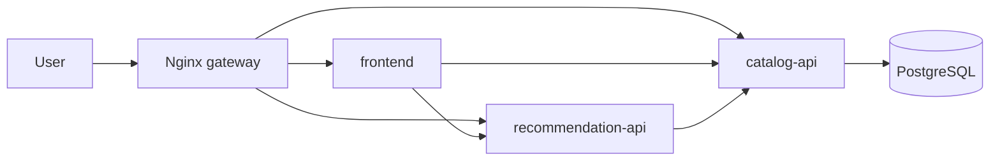

# Release Management Plan: RecipeOps Microservice CI/CD

## Executive Summary

RecipeOps is a service-oriented recipe management application with a Node.js frontend, a Node.js catalog API, a Python FastAPI recommendation API, and a PostgreSQL data layer. The catalog API owns recipe persistence. The recommendation API communicates with the catalog API over HTTP, which demonstrates service-to-service communication without sharing direct database access.

The implemented continuous delivery route uses GitHub Actions, GitHub Container Registry, SSH, Docker Compose, Nginx, and a Hetzner Cloud VM. Azure Terraform remains in the repository as the infrastructure-as-code research and alternative cloud target, but the working demonstrated CD path is Hetzner because the Azure tenant used for the project blocks the service-principal and OIDC setup required for fully automated Azure deployment.

The plan prioritises repeatability, automated release orchestration, rollback, and recoverability. Application images are built for `linux/amd64`, tagged with the Git commit SHA, scanned with Trivy, pushed to GHCR, and deployed to the inactive blue/green environment before traffic is switched through Nginx.

## Application Architecture

| Component | Technology | Responsibility |
|---|---|---|
| Frontend | Node.js / Express | User interface and browser-facing API proxy |
| Catalog API | Node.js / Express | Recipe CRUD, validation, seed data, database access |
| Recommendation API | Python / FastAPI | Calls the catalog API and ranks returned recipes |
| Data layer | PostgreSQL | Persistent recipe storage |
| Gateway | Nginx | Public HTTP entry point and blue/green traffic routing |

The deployed architecture uses one public gateway and private Docker networking between services. Users access the frontend through Nginx. API calls are routed through `/api/catalog/` and `/api/recommendations/`. PostgreSQL is not exposed publicly.



## Repository and Pipeline Model

The project uses a monorepo. This is the most suitable choice for the coursework because the services, Dockerfiles, orchestration files, infrastructure code, report, and demo material need to evolve together. Each service still has its own Dockerfile and test command, so the CI pipeline can build and validate the services independently inside the shared repository.

| Workflow | Trigger | Purpose |
|---|---|---|
| `ci.yml` | Pull request and main branch push | Run service tests, validate Terraform, build images, and upload Trivy SARIF |
| `deploy-hetzner.yml` | Main branch push or manual dispatch | Build images, push to GHCR, deploy to Hetzner over SSH, run health checks, switch traffic |
| `cd.yml` | Manual dispatch | Azure Container Apps path retained for Terraform/IaC demonstration where Azure identity permissions are available |

The Hetzner workflow is the demonstrated release path. It runs tests first, then builds the frontend, catalog API, and recommendation API as `linux/amd64` images. Each image is pushed to GHCR with the Git commit SHA and `latest` tags. The deployment job copies the Docker Compose and release scripts to `/opt/recipeops`, logs in to GHCR on the server, and runs `deploy.sh`.

## Infrastructure as Code

The working server path uses two layers of automation:

- `deploy/hetzner/cloud-init.yaml` provisions a replacement Ubuntu VM with Docker, firewall rules, `/opt/recipeops`, and a scheduled PostgreSQL backup cron job.
- `deploy/hetzner/compose.yml` defines the runtime platform: PostgreSQL, Nginx, and blue/green copies of each application service.

The Azure Terraform module provisions the Azure alternative:

- Resource Group
- Azure Container Registry
- Azure Container Apps Environment
- Three Azure Container Apps
- Azure Database for PostgreSQL Flexible Server
- Log Analytics Workspace
- PostgreSQL firewall rule

Terraform remote state is configured for Azure Blob Storage. This remains valuable for the RMP because it demonstrates how the container platform can be destroyed and recreated in a controlled way when the Azure tenant allows automated identity setup.

## Deployment Strategy

The chosen deployment strategy is blue/green.

On Hetzner, Docker Compose defines two sets of services:

- `catalog-blue`, `recommendation-blue`, `frontend-blue`
- `catalog-green`, `recommendation-green`, `frontend-green`

The `.env` file records:

- `ACTIVE_COLOR`
- `BLUE_TAG`
- `GREEN_TAG`
- `REGISTRY`
- `POSTGRES_PASSWORD`
- `APP_HTTP_PORT`

During deployment, `deploy.sh` chooses the inactive color, updates that color to the new image tag, starts it, runs health checks, writes an Nginx config for the new active color, and force-recreates Nginx so public port mappings are applied consistently. The previous color stays running, so rollback is a traffic switch rather than a rebuild.

The current gateway is intentionally force-recreated on every deploy and rollback:

```bash
docker compose up -d --force-recreate nginx
```

This prevents stale Nginx containers from keeping an old or missing port mapping after changes to `APP_HTTP_PORT` or port `80` ownership.

## Change Management Process

1. A developer changes code, Dockerfiles, scripts, Terraform, or documentation in Git.
2. Pull request CI runs service tests, image builds, Terraform validation, and Trivy scans.
3. Review approval is required before merge.
4. Merge to `main` starts `deploy-hetzner.yml`.
5. GitHub Actions builds all service images for `linux/amd64`.
6. Images are pushed to GHCR with a shared commit SHA tag.
7. The deploy job connects to Hetzner using a restricted SSH deployment key.
8. The inactive blue/green color is updated to the new commit SHA.
9. Health checks run against the inactive color before traffic is switched.
10. Nginx is force-recreated with the active color config.
11. The previous color remains available for immediate rollback.

This gives a consistent and repeatable change process. Every release is tied to a Git commit, every service in a release uses the same version tag, and the server state is driven by version-controlled scripts rather than manual file editing.

## Destroy and Replace Strategy

The orchestration system is disposable. To replace the server:

1. Create a new Hetzner VM with `deploy/hetzner/cloud-init.yaml`.
2. Create or copy the `deploy` SSH user and key.
3. Update the `HETZNER_HOST` GitHub secret to the new server IP.
4. Run the `deploy-hetzner` workflow.
5. Copy the latest backup into `/opt/recipeops/backups`.
6. Run `restore.sh` if data restoration is required.
7. Move DNS or public traffic to the replacement VM.

For Azure, the same principle is achieved through Terraform: destroy and recreate the resource group, Container Apps environment, registry, database, and app revisions from code and remote state.

## Secrets and Access

Hetzner CD uses GitHub Actions secrets:

| Secret | Purpose |
|---|---|
| `HETZNER_HOST` | Server IP or DNS name |
| `HETZNER_USER` | SSH user, preferably `deploy` |
| `HETZNER_SSH_KEY` | Private key accepted by the server |
| `HETZNER_PORT` | Optional SSH port, default `22` |
| `POSTGRES_PASSWORD` | PostgreSQL password written to the server `.env` |
| `APP_HTTP_PORT` | Optional public HTTP port, default `80` |
| `GHCR_USERNAME` | Optional GHCR username |
| `GHCR_TOKEN` | Optional GHCR read token for private packages |

A non-root `deploy` user is preferred over root SSH. The deployment user owns `/opt/recipeops` and is a member of the Docker group. Docker access is still powerful, but it is cleaner and more auditable than direct root deployment.

## Evaluation Criteria

### Performance

The Hetzner deployment runs all services on one 2 vCPU / 4 GB VM, which is sufficient for the coursework workload and gives predictable latency between containers. PostgreSQL is local to the Docker network, so database latency is low. The recommendation API adds one service-to-service HTTP hop to the catalog API; this is acceptable because it preserves service ownership boundaries.

### Ease of Configuration and Installation

Local development requires only Docker Compose. Hetzner requires one Ubuntu VM, SSH secrets, and the provided cloud-init and Compose files. The deployment is repeatable because server preparation, runtime configuration, release switching, backup, and restore are scripted.

### Cost and Licensing

The application stack uses open-source frameworks and tools. Hetzner provides predictable fixed monthly cost for the VM. This is cheaper and simpler than running a managed Kubernetes cluster for a small coursework system. Azure Container Apps remains a good managed option, but the project tenant restrictions made full Azure CD impractical without administrator support.

### Monitoring and Logging

On Hetzner, operational logs are available with:

```bash
docker compose logs
```

The APIs expose health endpoints and the deployment script calls those endpoints before switching traffic. A production extension would add central log forwarding, metrics dashboards, and alerting through Grafana Loki, Prometheus, or a managed equivalent.

### Scaling

Hetzner scaling is mainly vertical for this implementation: resize the VM or move to a larger VM. The design can also be extended to multiple VMs behind a load balancer, but this would add operational complexity. Azure Container Apps supports horizontal replica scaling and remains the better option for elastic scale where tenant permissions allow it.

### Rollback Plan

Rollback is handled by `rollback.sh`. By default it switches to the opposite of the current `ACTIVE_COLOR`; it can also target a specific color with `./rollback.sh blue` or `./rollback.sh green`. It rewrites Nginx to point back to the selected color and force-recreates the gateway. Because both colors remain running after deployment, rollback does not require rebuilding or pulling an old image. Database migrations should remain backward-compatible for at least one release so traffic rollback remains safe.

### Backup and Restore Strategy

The Hetzner deployment runs `backup.sh` daily from cron and stores compressed PostgreSQL dumps in `/opt/recipeops/backups`. Manual backup and restore are also supported:

```bash
cd /opt/recipeops
./backup.sh
./restore.sh backups/recipes-YYYYMMDDTHHMMSSZ.sql.gz
```

For stronger recovery, backups should be copied off-server using Hetzner snapshots, `rsync`, `rclone`, or object storage. Azure PostgreSQL Flexible Server has automated backup retention in the Terraform configuration.

### Security

The public surface is Nginx on HTTP port `80`. PostgreSQL and service containers are private to the Docker network. GitHub secrets hold deployment credentials. Images are scanned before deployment. Recommended hardening includes HTTPS with Caddy or Certbot, off-server backups, a dedicated deploy user, private GHCR packages with a scoped read token, and regular OS updates.

### Support

The chosen tools are mainstream and well-supported: GitHub Actions, GHCR, Docker Compose, Nginx, PostgreSQL, Node.js, FastAPI, Terraform, Azure Container Apps, and Hetzner Cloud. This reduces delivery risk and makes troubleshooting easier.

### Vulnerability Checks on Images

Trivy scans each service image for high and critical vulnerabilities. Results are uploaded as SARIF to GitHub code scanning. The workflow does not block deployment solely on base-image findings because those need triage, but it makes findings visible and auditable.

### Sustainability

The Hetzner option uses one small VM rather than an over-provisioned cluster. The CI pipeline builds only the three required service images. Azure Container Apps is also sustainable for future expansion because it avoids managing a full Kubernetes control plane.

## Additional Features

The implementation includes:

- Blue/green deployment on Hetzner.
- One-command rollback through `rollback.sh`.
- Automated PostgreSQL backups through cron.
- Trivy image scanning and SARIF upload.
- Health checks for both backend services.
- Seed data for repeatable demo evidence.
- Terraform Azure infrastructure as an alternative IaC target.

## Risks and Mitigations

| Risk | Impact | Mitigation |
|---|---|---|
| Port `80` already used by another container | Medium | Free the port or set `APP_HTTP_PORT`; deploy force-recreates Nginx |
| SSH key or deploy token leakage | High | Store secrets in GitHub, use a deploy user, rotate keys and tokens |
| VM loss | High | Rebuild from cloud-init, rerun CD, restore PostgreSQL dump |
| Database schema change breaks rollback | High | Keep migrations backward-compatible for at least one release |
| No HTTPS on initial VM | Medium | Add Caddy or Certbot before production use |
| Manual server edits cause drift | Medium | Re-run GitHub Actions and keep `/opt/recipeops` files sourced from the repo |
| GHCR package privacy blocks image pulls | Medium | Use `GHCR_TOKEN` with `read:packages` or make packages public |

## Conclusion

RecipeOps demonstrates an enterprise-style release management approach for a small microservice application. The working CD route proves automated tests, immutable image builds, vulnerability scanning, GHCR publishing, SSH-based release orchestration, blue/green traffic switching, rollback, and database backup/restore. Azure Terraform remains as the managed cloud IaC option, while Hetzner provides the practical demonstrated deployment path for the coursework environment.
